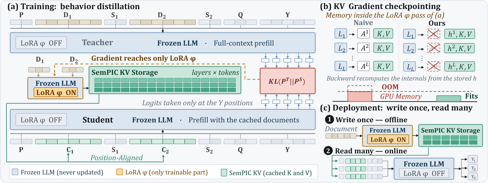
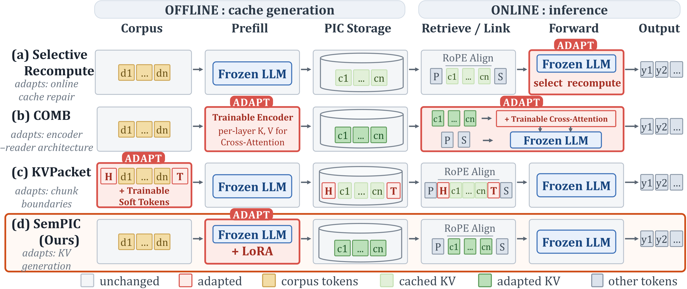

# SemPIC

SemPIC learns semantic position-independent KV caches for multi-document RAG. It adapts a LoRA-enabled document Writer to compile reusable native per-layer KVs while keeping the pretrained Reader and cache-hit decoding path unchanged. The repository also provides KV Gradient Checkpointing, joint SemPIC + KV Packet training, evaluation, attention analysis, and visualization.

The implementation and experimental framework build on [KV Packet](https://github.com/ChuangtaoChen-TUM/KVPacket). SemPIC follows its self-supervised distillation formulation while moving the trainable locus from boundary tokens to the native document Writer.



*SemPIC trains a LoRA-enabled document Writer through behavioral distillation, preserves the pretrained Reader, and reuses the compiled KVs through the standard cache-hit path.*

## Position-Independent Cache Design Space

SemPIC fits into the broader position-independent caching (PIC) design space by adapting native document KV generation offline while retaining standard KV storage and an unchanged online Reader.



*Position-independent cache design space. SemPIC moves offline adaptation from KV Packet's boundary tokens to native document KV generation while retaining standard KVs and an unchanged Reader.*

## Method Names

`cache_comb.method` uses the following names for the three artifact-backed methods:

| Method            | Artifacts                             | Description                                                                                                       |
| ----------------- | ------------------------------------- | ----------------------------------------------------------------------------------------------------------------- |
| `kvpacket`        | `packet_wrapper.path`                 | KV Packet boundary-token PacketWrapper method.                                                                    |
| `sempic`          | `lora.path`                           | SemPIC document-wide adaptation through the native document Writer.                                               |
| `sempic_kvpacket` | `packet_wrapper.path` and `lora.path` | Combine SemPIC Writer adaptation with KV Packet PacketWrapper adapters, using joint or independently trained artifacts. |

`packet_wrapper` is the component name for the header/trailer wrapper. It is not the project name.

## Project Structure

```text
sempic/
├── run_train.py                # Train LoRA, PacketWrapper, or joint adapters
├── run_generation_cache.py     # Build one immutable teacher-cache artifact
├── run_eval.py                 # Evaluate cache combination methods
├── run_attention_analysis.py   # Collect, process, and plot attention profiles
├── run_process_attention.py    # Reprocess saved profiles without a model
├── run_eval_dashboard.py       # Browse and compare evaluation results
├── run_build_packet.py         # Initialize PacketWrapper artifacts from handcrafted tokens
├── sempic/                     # Core library
│   ├── packet_wrapper/         # PacketWrapper tensors
│   ├── cache/                  # KV cache storage, quantization, compression, re-rotation
│   ├── cache_comb/             # Cache combination methods and baselines
│   ├── dataset/                # Dataset loaders
│   ├── model/                  # Supported model definitions
│   └── utils/                  # Training, generation cache, metrics, config loading
├── train_config/               # Training configs
├── generation_cache_config/    # Standalone teacher-cache configs
├── eval_config/                # Evaluation configs
├── train_outputs/              # Concrete timestamped training runs
├── eval_outputs/               # Timestamped evaluation invocations and config runs
├── generation_cache/           # Optional teacher generation caches
└── plot_scripts/               # Result visualization
```

## Setup

Create and sync the project environment with `uv`:

```bash
uv venv --python 3.12 .venv
uv sync
```

Run commands through `uv` from the repository root:

```bash
uv run python run_eval.py <config.json> --debug
```

Before running generation-cache, training, or evaluation commands, set `model.model_path` and any explicit `model.tokenizer_path` in the selected config or its sibling `_default.json` to the same local model directory or Hugging Face model identifier. A sibling `_default.json` fills fields missing from a selected config; fields set by the selected config win, including nested model fields.

## Train

`run_train.py` supports LoRA-only, PacketWrapper-only, and joint training. Each config sets `output_dir` to the method root `train_outputs/<model>/<dataset>/<method>`. A new run uses `<output_dir>/<YYYYMMDD_HHMMSS[_suffix]>/`; the runtime PEFT adapter name must be `default`, LoRA is saved to `<run_dir>/lora/`, and PacketWrapper is saved to `<run_dir>/packet_wrapper.pt`. Joint training writes both into the same run directory.

The method directory is one of `kvpacket`, `sempic`, or `joint`. The optional top-level `run_suffix`, or CLI `--run-suffix` which takes precedence, must start with an alphanumeric character and may otherwise contain letters, digits, `.`, `_`, and `-`. If a run name already exists, allocation appends `_1`, `_2`, and so on.

For a continuous Qwen3-4B Biography LoRA workflow, first generate the teacher cache selected by the training defaults, then start training:

```bash
CUDA_VISIBLE_DEVICES=0 uv run python run_generation_cache.py generation_cache_config/qwen_3_4b_teacher/biography_greedy_kl_1024.json
CUDA_VISIBLE_DEVICES=0 uv run python run_train.py train_config/qwen_3_4b/biography/lora_only_kl.json
```

The generated `generation_cache/artifacts/qwen_3_4b_teacher/biography_greedy_kl_1024/` artifact contains `cache.safetensors`, `manifest.json`, and `resolved_config.json`. Training validates manifest compatibility and reads payload tensors one entry at a time. A list of compatible artifact directories in `cache_path` composes their entries for mixture training. Training `model.generation_kwargs` is used only for an in-memory teacher cache when `cache_path` is null. See [res/generation_cache_config.md](./res/generation_cache_config.md).

The training entrypoint also accepts multiple files or a directory. Use `packet_only_kl.json` for PacketWrapper-only training or `packet_lora_joint_kl.json` for joint training:

```bash
uv run python run_train.py <config.json> [<config2.json> ...]
uv run python run_train.py train_config/qwen_3_4b/biography/
uv run python run_train.py train_config/qwen_3_4b/biography/packet_lora_joint_kl.json --run-suffix paper
uv run python run_train.py train_config/qwen_3_4b/biography/packet_lora_joint_kl.json \
  --resume-from ./train_outputs/qwen_3_4b/biography/joint/<run-directory>
```

Each run directory also contains `run.log`, `resolved_config.json`, `train_config.json`, and `cli_args.json`; `debug/` is created lazily when debug artifacts are emitted. After each complete epoch, training replaces `<run_dir>/checkpoint.pt`; `--resume-from` reuses that concrete run directory and checkpoint. After the final artifacts save successfully, training removes the checkpoint. Evaluation configs pin repository-relative artifact paths from concrete timestamped runs, and each config stem includes the training-run suffix.

## Evaluate

Run one or more evaluation configs. Every CLI call creates an invocation directory at `eval_outputs/_invocations/<YYYYMMDD_HHMMSS[_suffix]>/` containing `run.log` and `cli_args.json`; it records discovery, skip decisions, warnings, and overall status. A validated config creates its own run only when evaluation is about to start:

```text
eval_outputs/<config-scope>/<eval-method>/<YYYYMMDD_HHMMSS>_<config-stem>[_suffix]/
```

For configs under `eval_config/`, `<config-scope>` is the config's parent path relative to `eval_config/`. External configs use a deterministic `_external/<safe-parent-name>/<safe-config-stem>` scope. `<eval-method>` is `cache_comb.method`.

```bash
uv run python run_eval.py <config.json or directory> [--overwrite] [runtime flags]
```

The repository includes artifact-free baselines that can run directly after model setup:

```bash
uv run python run_eval.py eval_config/qwen_3_4b/biography/full_recompute.json --overwrite
uv run python run_eval.py eval_config/qwen_3_4b/biography/no_recompute.json --overwrite --run-suffix paper
```

After training, create an artifact-backed config beside the dataset's `_default.json`. For example, create `eval_config/qwen_3_4b/biography/sempic__<run-directory>.json` with the concrete repository-relative LoRA path:

```json
{
  "cache_comb": {"method": "sempic", "kwargs": {}},
  "lora": {
    "path": "./train_outputs/qwen_3_4b/biography/sempic/<run-directory>/lora"
  }
}
```

Then evaluate that config:

```bash
uv run python run_eval.py eval_config/qwen_3_4b/biography/sempic__<run-directory>.json --overwrite
```

Use the same pattern with `packet_wrapper.path` for `kvpacket`, or both artifact paths for `sempic_kvpacket`; see [res/eval_config.md](./res/eval_config.md).

Top-level `run_suffix` optionally names a config run. CLI `--run-suffix` overrides it for config runs and is the only suffix applied to the invocation directory. The suffix follows the same validation rules as training, and name collisions append `_1`, `_2`, and so on.

Each config run contains `run.log`, `eval_config.json`, `resolved_config.json`, `cli_args.json`, a lazily created `debug/`, and, after successful evaluation, the canonical `<config-stem>_result.json`. Evaluation then atomically copies real JSON to the stable adjacent path `<config-parent>/eval_results/<config-stem>_result.json`. `--overwrite` controls whether evaluation starts when that stable result already exists; it never replaces a timestamped run. A failed config run keeps its diagnostic files but does not publish a result. If only stable publication fails after the canonical write, the prior stable result remains intact and the canonical result remains available. Both result copies preserve the configured concrete repository-relative artifact paths.

The training and evaluation entrypoints support these runtime controls:

```bash
--debug --no-debug --log-level <level> --debug-sample-limit <n> --run-suffix <suffix>
```

## Attention Analysis

`run_attention_analysis.py` performs one real-forward statistics pass, one model-free
processing pass, and visualization. The statistics are shared by any number of
timestamped analysis variants, each containing one processing config, compact metrics,
and a PDF figure set. The paper preset runs terminal, literal gold-answer, and shifted-
prediction query passes. Each real forward feeds attention-profile and head-preserving
PIC-retrieval reducers together. One invocation may include multiple datasets and models:

```bash
CUDA_VISIBLE_DEVICES=0 uv run python run_attention_analysis.py \
  eval_config/qwen_3_4b/biography/full_recompute.json \
  eval_config/qwen_3_4b/biography/no_recompute.json \
  --analysis-config attention_config/paper_attention.json \
  --processing-config attention_config/processing_default.json \
  --max-samples 10 \
  --cpu-threads 4 \
  --run-name smoke
```

After creating artifact-backed eval configs for trained adapters, add their config paths to the same command. Every model/dataset group must include `full_recompute`; supported candidate methods are `no_recompute`, `kvpacket`, `sempic`, and optionally `sempic_kvpacket`.

The command prints the created `attention_results/<timestamp>_paper_attention_smoke`
directory. Resume that exact run without supplying eval or analysis configs:

```bash
CUDA_VISIBLE_DEVICES=0 uv run python run_attention_analysis.py \
  --resume-run attention_results/<run-directory>

uv run python run_process_attention.py \
  --run-dir attention_results/<run-directory> \
  --processing-config attention_config/processing_default.json \
  --suffix paper \
  --cpu-threads 4

uv run python plot_scripts/draw_attention_analysis.py \
  attention_results/<run-directory>/analysis/<timestamp>-paper
```

Each processing command prints its newly allocated analysis variant. Without
`--suffix`, variants receive run-global numeric suffixes such as `-0` and `-1`;
existing variants are preserved. The plot command only re-renders the selected
variant.

Each `model × dataset × query pass` partition contains Full Recompute plus all
requested candidate methods. Saved tensors contain only reduced attention and
per-query-head retrieval sufficient statistics, not raw QK/Value blocks. Processing
supports raw and conditional position heatmaps, separate Prefix/Interior/Suffix errors,
global error, retrieval NRMSE, cosine distance, and attention-mass error. Prefix and
suffix are never folded into a nearest-boundary coordinate. Each variant keeps compact
tensor-valued records in `metrics.pt`; it does not expand them into a full CSV.
For each model, visualization writes exactly five multi-page PDFs:
`attention_maps.pdf`, `attention_error_structure.pdf`, `retrieval_nrmse.pdf`,
`retrieval_cosine_distance.pdf`, and `retrieval_mass_error.pdf`. Dataset rows stay
separate; query passes and attention views are pages rather than separate files.
See [res/attention_analysis.md](./res/attention_analysis.md) for the full contract.

## Evaluation Dashboard

Start the local evaluation dashboard from the repository root:

```bash
# Latest stable results next to source configs
uv run streamlit run run_eval_dashboard.py --server.headless true -- --root eval_config

# Timestamped config-run history
uv run streamlit run run_eval_dashboard.py --server.headless true -- --root eval_outputs
```

Choose one source view per dashboard process: scan `eval_config` for the latest stable results or `eval_outputs` for timestamped history, but do not scan both because they contain copies of the same completed results. Repeat `--root` only to add trees within the selected view. The sidebar discovers directories containing `*_result.json`, controls the selected source directories, and applies the shared model and method scope.

The dashboard is organized around four workflows:

- **Runs** is the default exact-result browser. Every result file remains one row, with dataset and regular-expression filters, metric-aware sorting, and selected-run config/result provenance. It never aggregates checkpoints.
- **Experiment** compares exact runs within one model and dataset context. Its leaderboard, ranked single-metric chart, and exact F1-versus-TTFT/FLOPs trade-off charts use the same snapshot without averaging repeated series. TTFT mean reads `ttft_mean` and falls back to `ttft` when needed; available P50 and P99 values remain explicit.
- **Cross-dataset** starts with exact observations. Dataset-matched algorithm rollup is an explicit aggregated mode because the result format cannot prove that different checkpoints share a training recipe. Aggregated views show their grouping rule, included observations, distinct checkpoints, exclusions, and source provenance. `Shared checkpoint` remains available for one exact artifact combination evaluated across datasets.
- **Audit** contains source directories, parse warnings, raw config/result JSON, exact snapshot exports, and an auditable metric summary with its estimator, grouping rule, and source/checkpoint membership.

Run-label and resolved-path filters use Python `re.search`, combine using AND, and are case-sensitive unless the expression includes `(?i)`. Empty expressions do not filter. Invalid expressions produce a visible diagnostic and an empty Runs view instead of interrupting the dashboard. View-specific filters do not silently change the other workflows, and customized selections remain customized across refreshes.

The project Streamlit configuration binds the service to `127.0.0.1` by default because result views include local paths and raw evaluation configs. Binding another address is an explicit operator choice.

## Paper

*SemPIC: Learning Semantic Position-Independent KV Caches*

The SemPIC paper is not yet publicly available.

## Acknowledgements

This implementation and experimental framework build on the [KV Packet codebase](https://github.com/ChuangtaoChen-TUM/KVPacket). See and cite the [KV Packet paper](https://arxiv.org/abs/2604.13226).

## Documentation

- Training config reference: [res/train_config.md](./res/train_config.md)
- Evaluation config reference: [res/eval_config.md](./res/eval_config.md)
- Attention analysis metrics and plots: [res/attention_analysis.md](./res/attention_analysis.md)

## Supported Models

| Model family | Recommended template key |
| --- | --- |
| Llama 3.1 | `"tokenizer_chat"` |
| Qwen3 | `"tokenizer_chat"` |

Adding a new model requires implementing model-specific KV re-rotation in `sempic/cache_comb/recompute_kv/` and registering it in `sempic/model/`.
